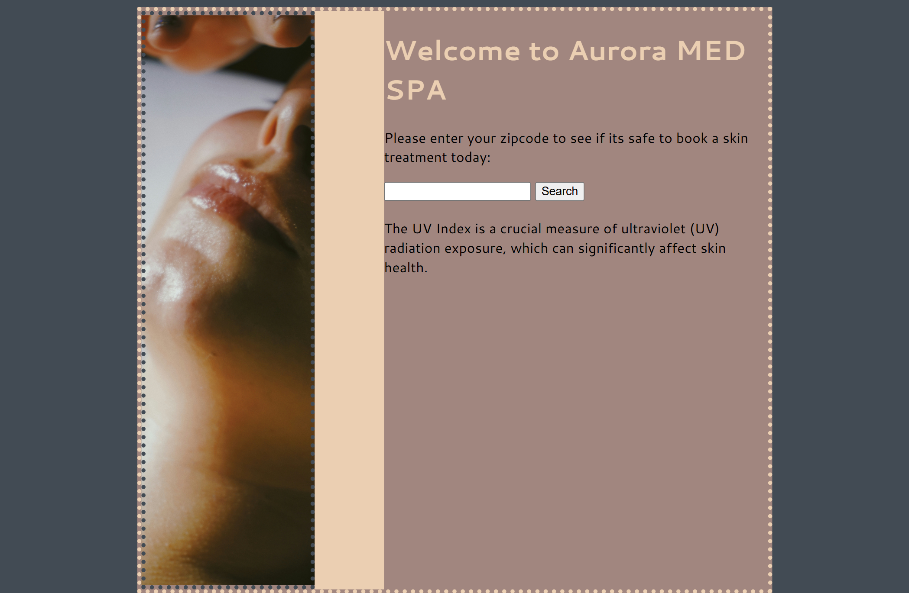
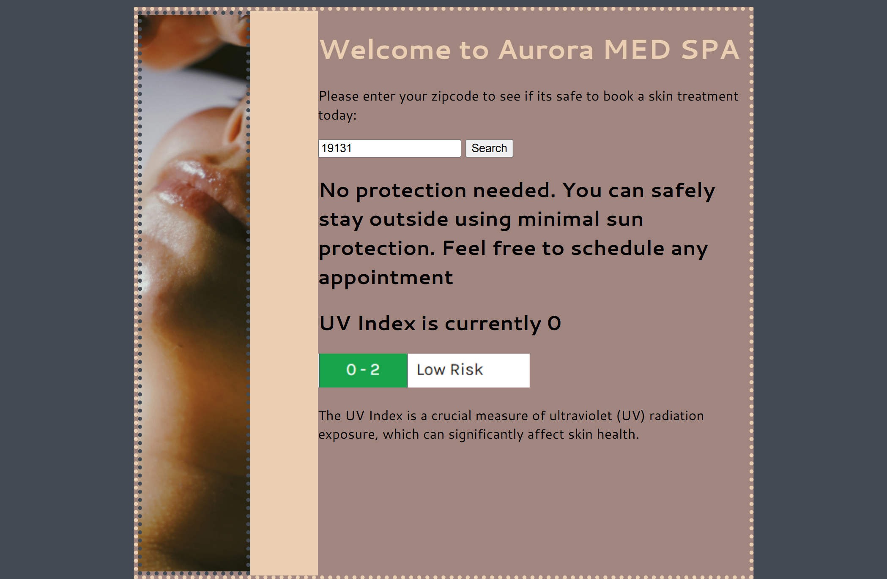

# 👩🏾‍⚕️ Aurora MED SPA

## Project Description

Aurora MED SPA is a web application that helps users check current UV conditions for their ZIP code before scheduling a skin treatment. It uses the Geocod.io API to convert a ZIP code into geographic coordinates, then sends those coordinates to the CurrentUVIndex API to retrieve current UV data.

The application displays the current UV Index, a color-coded visual indicator, and a recommendation based on the returned value. 

## Tech Stack

- **HTML** 
- **CSS**
- **JavaScript**

## How to Run or View It

1. Clone or download the repository.
2. Open `index.html` in a browser or serve the project using a local development server.
3. Enter a ZIP code in the search field.
4. Click **Search** to retrieve geographic coordinates and current UV Index data.
5. Review the displayed UV Index, visual indicator, and recommendation.

The application requires an internet connection to access its external APIs. API availability and credential requirements may affect the results.

## Screenshots and Demo

### Application Interface

The interface includes a ZIP-code search field, a treatment recommendation, the current UV Index, and a color-coded risk indicator.

